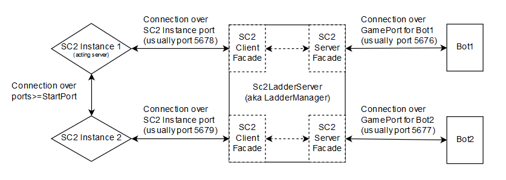

# Sc2LadderServer
A ladder server for SC2 API.

New proxy interface is now implemented, the DLL instructions are out of date.  I will update the instructions within a few days

--------

This will load bots as defined in the LadderBots.json file

The `./data/` directory is writable, you should create a subdirectory with your bot name if you want to write data files.

Requires Blizzard API files (see below).

------


# Developer Install / Compile Instructions
## Requirements
* [CMake](https://cmake.org/download/)
* Starcraft 2 ([Windows](https://starcraft2.com/en-us/)) ([Linux](https://github.com/Blizzard/s2client-proto#linux-packages)) 
* [Starcraft 2 Map Packs](https://github.com/Blizzard/s2client-proto#map-packs) 

## Windows

* Download and install [Visual Studio 2017](https://www.visualstudio.com/downloads/) if you need it.

```bat
:: Clone the project
$ git clone --recursive https://github.com/Cryptyc/Sc2LadderServer.git
$ cd Sc2LadderServer

:: Create build directory.
$ mkdir build
$ cd build

:: Generate VS solution.
$ cmake ../ -G "Visual Studio 15 2017 Win64"

:: Build the project using Visual Studio.
$ start Sc2LadderServer.sln
```

 ### Linux and OS X
 
 ```bash
 # Clone the project.
 $ git clone --recursive https://github.com/Cryptyc/Sc2LadderServer.git
 $ cd Sc2LadderServer
 
 # Create build directory.
 $ mkdir build
 $ cd build
 
 # Generate a Makefile.
 $ cmake ../
 
 # Build.
 $ make
 ```

### Submodules
If you don't initially do a `--recursive` clone (in which case, submodule folders will be left empty), you can download any submodules later like so:
```
git submodule update --init --recursive
```
Alternatively, you could opt to symlink the folder of the submodule in question to an existing copy already on your computer. However, note that you will very likely be using a different version of the submodule to that which would otherwise be downloaded in this repository, which could cause issues (but it's probably not too likely). 
 
## Configuration

### Maps
Make sure you've installed the maps, as per the directions from [Blizzard's SC2Client-Proto project](https://github.com/Blizzard/s2client-proto#map-packs).
   
### Configuration files
All configuration files should be placed in the project root directory.

##### LadderManager.json
Create a file called `LadderManager.json` It should be in json format, with entries as described in the table below.
 
| Config Entry Name | Description |
|---|---|
| `ErrorListFile`	    	|	Place to store games where errors have occured |
| `BotConfigFile`	    	|	Location of the json file defining the bots |
| `MaxGameTime`	    		|	Maximum length of game |
| `CommandCenterDirectory`	|	Directory to read .ccbot command center config files |
| `LocalReplayDirectory`	|	Directory to store local replays |
| `EnableReplayUpload`		|	True/False if replays and results should be uploaded |
| `UploadResultLocation`	|	Location of remote server to store results |
| `ResultsLogFile`			|	Local file to store results in json format |
| `PlayerIdFile`			|	Location of file to store player IDs.  |

##### BotConfigFile.json
Create a `BotConfigFile.json`  file that will describe the roster of bots and their required attributes.  It should also contain an array of maps to be used.  For each map you want the bots to play on, add its name into this array, **including** the `.SC2Map` file ending.

## CommandCenter
CommandCenter bots are supported. Just add the json config file in the command center directory with the .ccbot extension.   
   
## Debugging
DebugBot (included in this repo) can be used for debugging if you don't want to wait around for real bots to fight it out.

## Architecture
The ladder server establishes a facade in between the bots and the SC2 instances, as is illustrated below.

